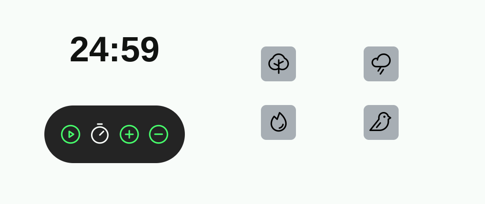

<h1 align="center">Focus Timer 2.0 </h1>

Projeto  Focus Timer desenvolvido no modulo 5 do curso Explorer  

  <a href="#-tecnologias">Tecnologias</a>&nbsp;&nbsp;&nbsp;|&nbsp;&nbsp;&nbsp;
  <a href="#-projeto">Projeto</a>&nbsp;&nbsp;&nbsp;|&nbsp;&nbsp;&nbsp;
  <a href="#-layout">Layout</a>&nbsp;&nbsp;&nbsp;|&nbsp;&nbsp;&nbsp;
  <a href="#memo-licença">Licença</a>

  

 

  

## 🚀 Tecnologias

Esse projeto foi desenvolvido com as seguintes tecnologias:

- HTML
- CSS
- JavaScript
- Git e Github
- Figma

## 💻 Projeto
O projeto foi desenvolvido com o propósito de auxialiar no gerenciamento do tempo de realização de uma determinada tarefa ou estudo trazendo o conceito da técnica POMODORO.O Método Pomodoro é um método de gerenciamento de tempo baseado em períodos de 25 minutos e intervalo de cinco minutos vizando desenvolver uma tarefa com o maior foco e sem interrupções.   
Projeto desenvolvido para mobile e desktop . -[Visite o projeto online](https://pedroqueirozs.github.io/focusTimer/)

## 🔖 Layout

Você pode visualizar o layout do projeto através [DESSE LINK](<https://www.figma.com/file/5f1nBejr3qSmO0xtNAs75T/Focus-Timer-V2-%E2%80%A2-Projeto-Explorer-(Community)?type=design&node-id=0-1&mode=design&t=324ynh9Gj65iVwXC-0>). É necessário ter conta no [Figma](https://figma.com) para acessá-lo.

## :memo: Licença

Esse projeto está sob a licença MIT.

---
